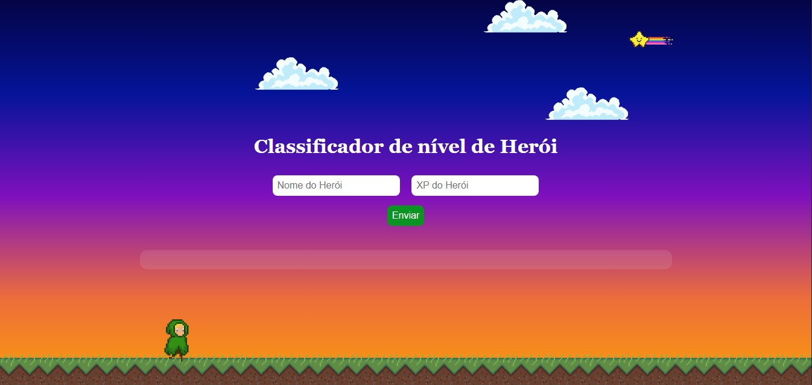

<h1 align="center">🦸‍♀️ Classificador de Herói</h1>

<p align="center">
  Um mini projeto criado com amor 💛 durante os desafios da <strong>DIO</strong>, onde o usuário informa o nome e XP do herói para descobrir sua <em>classificação épica</em>!
</p>

<div align="center">
  
  
  
</div>

---

## 🧠 Objetivo

Praticar estruturas condicionais com `if/else` no JavaScript, agora com uma pitada de estilo usando HTML + CSS.  
O projeto classifica heróis de acordo com a quantidade de XP inserida pelo usuário.

---

## 🚀 Tecnologias usadas

- 🎨 HTML5
- 💅 CSS3
- 🧠 JavaScript (puro)

---

## 💡 Lógica do projeto

A classificação segue os critérios abaixo:

| 🏅 Nível       | 🧪 XP necessário  |
|---------------|------------------|
| Ferro         | 0 – 1.000 XP     |
| Bronze        | 1.001 – 2.000 XP |
| Prata         | 2.001 – 5.000 XP |
| Ouro          | 5.001 – 7.000 XP |
| Platina       | 7.001 – 8.000 XP |
| Ascendente     | 8.001 – 9.000 XP |
| Imortal      | 9.001 – 10.000 XP|
| Radiante      | 10.001+ XP       |

---

## 🖼️ Interface do projeto

> ✨ Interface simples e intuitiva feita com HTML + CSS.

<!-- Substitua o caminho abaixo pela imagem da interface -->
<p align="center">
  
</p>

---

## 🧪 Como testar

1. Clone o repositório:
```bash
git clone https://github.com/ToriEllen/desafio-logica-inicial.git
